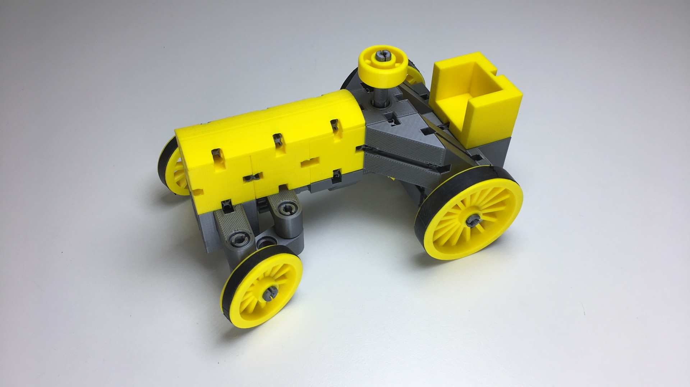

# kbricks construction system

**kbricks** (pronounced *"kay-bricks"*) is a fully 3d-printable, open source construction system. It allows for building stable models that don't fall into pieces when playing with them. kbricks parts can be printed with almost any state-of-the-art 3d printer.

This repository contains the core parts of the construction system.

## Available parts

There are three fundamental types of parts that make up the kbricks construction system: cubes, plates, and beams. Parts are connected by two types of connectors: slide connectors and pegs. Furthermore, there are wheels, gears, axles, steerings, and icing parts which make the models look nice.

  

**STL files** of all available kbricks parts can be found in the *stl* folders of this repository. The parts are organized into the following categories:

* [Cubes](stl/cubes)
* [Plates](stl/plates)
* [Beams](stl/beams)
* [Connectors](stl/connectors)
* [Wheels](stl/wheels)
* [Gears](stl/gears)
* [Axles](stl/axles)
* [Steerings](stl/steerings)
* [Icing](stl/icing)

## Available models

kbricks makes it easy to design your own models. Examples will become available in [kbricks-models](https://github.com/kbricks/kbricks-models) repository. The following picture shows a kbricks tractor:

  

## Printing instructions

All parts can be printed using virtually any state-of-the-art 3d printer. For our tests, the [Prusa i3 MK3](https://en.wikipedia.org/wiki/Prusa_i3) was used. Recommended materials are PLA and PETG with a layer height of 0.15 mm. All parts are printed without support but for some parts, specific print settings are required:

* **Cubes** contain a thin embedded support structure that needs to be removed after printing. Option *Detect thin walls* needs to be checked in the slicer software to allow for printing these structures.
* **Connectors** should be printed with *brim* to increase the adhesion on the print plate.
* **Beams with peg** (needed for steerings) should be printed with *Support on build plate only*.

## Assembling models

Models are assembled by connecting its parts with slide connectors and pegs. A hex key may be helpful for inserting the slide connectors. This [video](https://youtu.be/3_plykmoSQs) (2 min) shows how to assemble a simple kbricks model.

## Disassembling models

To disassemble a kbricks model, simply **pull out** the slide connectors using a needle-nosed pliers or **push** them out using a hex key. Pegs can be pushed out using an axle.

## Licenses

1. kbricks by Robert Kern is licensed under the [Creative Commons - Attribution - Non-Commercial - Share Alike](LICENSE.txt) license.
2. kbricks was designed using the [OpenSCAD](https://www.openscad.org) 3D CAD modeller licensed under [General Public License version 2](http://www.gnu.org/licenses/gpl-2.0.html).
3. kbricks [Gears](img/gears) use the [Gears Library for OpenSCAD](https://www.thingiverse.com/thing:1604369) by [janssen86](https://www.thingiverse.com/janssen86) licensed under the [Creative Commons - Attribution - Non-Commercial - Share Alike](http://creativecommons.org/licenses/by-nc-sa/3.0/) license.
